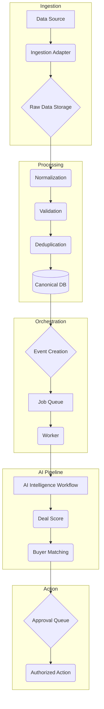

# PHASE 30 — PRODUCTION RUNTIME AND CONTINUOUS DATA INGESTION

## 1. Objective

Phase 30 transforms the system from a local, manually-triggered simulation harness into a continuously operating runtime architecture. The goal is to establish a durable, scalable, and reliable foundation for ingesting data, processing it through the AI pipeline, and managing workflows without requiring manual intervention for each run.

This architecture is designed for staged growth, starting with a single data source and expanding over time. All safety controls, such as the human-in-the-loop approval queue, remain in place.

## 2. Production Runtime Architecture

The new architecture follows a clear, sequential data processing pipeline, moving from raw data ingestion to actionable intelligence.

### 2.1. Key Components

- **`ContinuousRuntime`**: The main orchestrator that manages the entire lifecycle. It controls the operating mode, triggers ingestion, and dispatches workers.
- **`IngestionEngine`**: Fetches data from authorized providers, stores the raw payload, and creates a log of the ingestion run (`IngestionRun`).
- **`NormalizationEngine`**: Converts provider-specific raw data into a standardized `CanonicalProperty` model.
- **`DeduplicationEngine`**: Prevents the creation of duplicate records by checking for existing entities based on unique identifiers (e.g., a hash of the address).
- **`RuntimeJobQueue`**: A durable job queue system that tracks the status of each job (`PENDING`, `RUNNING`, `COMPLETED`, `FAILED`, `RETRY_SCHEDULED`, `DEAD_LETTER`).
- **`Worker`**: A process that pulls jobs from the queue, executes the AI intelligence pipeline for a given entity, and updates the job status.

## 3. Data Flow and Models

### 3.1. Ingestion and Normalization
1.  The `IngestionEngine` polls an authorized data source.
2.  The raw payload is saved (simulated) and an `IngestionRun` record is created to log metrics (records discovered, inserted, etc.).
3.  For each new raw record, the `NormalizationEngine` creates a `CanonicalProperty` object.
4.  The `DeduplicationEngine` generates a fingerprint (e.g., a hash of the normalized address) and checks if it has been processed. If it's a duplicate, the process stops for that record.
5.  The new canonical record is saved to the database (simulated).

### 3.2. Event and Job System
1.  After a new canonical record is saved, an `Event` is created (e.g., `PROPERTY_DISCOVERED`).
2.  This event is used to create a `Job` in the `RuntimeJobQueue` with a status of `PENDING`. The job payload contains the ID of the entity to be processed.
3.  The job system is idempotent; submitting a job with an ID that is already pending or completed will be ignored.

### 3.3. Worker and AI Pipeline
1.  A `Worker` polls the `RuntimeJobQueue` for pending jobs.
2.  It picks up a job, changes its status to `RUNNING`, and executes the AI pipeline (simulated by calling the `EndToEndDealSimulation` logic from Phase 23).
3.  If the pipeline succeeds, the job status is set to `COMPLETED`.
4.  If it fails, the `ReliabilityEngine` logic from Phase 28 is used to handle retries with exponential backoff. After all retries are exhausted, the job is moved to a `DEAD_LETTER` state.

## 4. Implementation Details

### New Files
- `ai_real_estate_deal_intelligence_machine/phase30.py`: Contains all the new runtime components, including the `ContinuousRuntime`, `IngestionEngine`, `RuntimeJobQueue`, `Worker`, and the associated data models (`OperatingMode`, `IngestionRun`, `CanonicalProperty`, `RuntimeEvent`, `Job`).
- `tests/test_phase30_runtime.py`: A comprehensive test suite that verifies the entire continuous processing flow, including data ingestion, deduplication, job creation, worker execution, and failure handling.

### Key Logic
- **`OperatingMode` Enum**: Enforces clear separation between `DEVELOPMENT`, `MOCK`, `PILOT`, and `PRODUCTION` modes. The runtime will refuse to run in certain configurations if the mode is not set correctly (e.g., using a live provider in `MOCK` mode).
- **Idempotency**: Both the deduplication engine (content-based) and the job queue (ID-based) have mechanisms to prevent duplicate processing.
- **Durability (Simulated)**: The components are designed as if they were interacting with a persistent database and a distributed job queue like Redis or RabbitMQ. State is managed within the classes for this simulation.

## 5. Verification and Reporting

The `test_continuous_runtime_flow` in `test_phase30_runtime.py` verifies the core functionality:
1.  **Ingestion**: A new record is ingested.
2.  **Deduplication**: The same record ingested again is correctly identified as a duplicate and skipped.
3.  **Job Creation**: A job is created for the new record and placed in the queue.
4.  **Worker Execution**: A worker successfully processes the job.
5.  **Failure and Retry**: A simulated failure causes the job to be retried and eventually moved to the dead-letter queue.
6.  **Mock/Live Separation**: The runtime's operating mode is respected.

## 6. Current Limitations and Next Steps

### Current Limitations
- **Simulated Persistence**: The canonical database, raw data store, event log, and job queue are all simulated in-memory. A real implementation would require integrating with technologies like PostgreSQL, S3, and Redis.
- **Single Worker**: The current implementation simulates a single worker process. A production system would run multiple workers in parallel.
- **Simplified AI Pipeline**: The worker simulates running the AI pipeline but doesn't yet fully integrate the output back into the event system to trigger downstream workflows (e.g., buyer outreach).

### Requirements Before Live Data Integration
1.  **Replace In-Memory Stores**: Implement connections to a real database (e.g., PostgreSQL) and a real job queue (e.g., Redis).
2.  **Containerize the Application**: Package the runtime, workers, and any API components into Docker containers for scalable deployment.
3.  **Implement a Real Ingestion Adapter**: Connect the `IngestionEngine` to a real, authorized API from a data provider like ATTOM (using the `AttomApiProvider` from Phase 26).
4.  **Full Observability**: Integrate a proper logging, metrics, and tracing solution (e.g., OpenTelemetry) to monitor the health of the continuous runtime.

## 7. Conclusion

Phase 30 successfully establishes the architectural blueprint and a simulated implementation of a production-grade continuous runtime. It replaces the manual, one-shot harness with a durable, event-driven, and job-based system capable of continuous data ingestion and processing. While the underlying persistence and queuing are still simulated, the logic for normalization, deduplication, job management, and worker execution is now in place, providing a solid foundation for connecting live data sources.