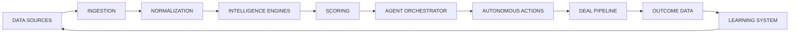

# PHASE 0 — AI DEAL MACHINE OPERATING BLUEPRINT

## 1. Objective

Phase 0 defines the complete operating architecture for the AI Real Estate Deal Intelligence Machine without building major product features. This document is the architectural source of truth for all later phases.

The system is designed to operate as a continuous autonomous intelligence loop:

- discover opportunities,
- validate them,
- analyze them,
- score and prioritize them,
- route them into acquisition or disposition workflows,
- track outcomes,
- learn from verified results,
- and adapt the next cycle.

---

## 2. Complete System Architecture

### 2.1 Architectural Layers

1. Data Sources
   - Authorized APIs
   - Licensed data providers
   - Government/public data where permitted
   - User-uploaded dataset feeds
   - CSV and structured file imports
   - Authorized partner integrations

2. Ingestion Layer
   - Provider adapter abstraction
   - Source polling and stream handlers
   - Event capture and normalized snapshots

3. Normalization Layer
   - Standardize property, seller, buyer, market, and transaction schemas
   - Resolve duplicates and canonical IDs
   - Enrich base records with geographic and market metadata

4. Intelligence Engine Layer
   - Market Intelligence Engine
   - Property Intelligence Engine
   - Buyer Intelligence Engine
   - Seller Intelligence Engine
   - Comparable Sales Engine
   - ARV Analysis Engine
   - Repair Estimation Engine
   - Deal Risk Engine
   - Opportunity Scoring Engine
   - Buyer Matching Engine

5. Agent Orchestration Layer
   - Agent registry
   - Task queue
   - Workflow scheduler
   - Approval / supervision policies
   - Escalation router
   - Audit event bus

6. Autonomous Action Layer
   - Acquisition automation
   - Disposition automation
   - CRM updates
   - Follow-up scheduling
   - Alerts and reporting

7. Deal Pipeline Layer
   - Opportunity records
   - Active deal records
   - Buyer and seller engagement states
   - Underwriting package storage
   - Deal room artifacts

8. Learning and Outcome Layer
   - Outcome event recording
   - Verified-results feedback loop
   - Score-logic review and reversible adaptation
   - Performance analytics

9. Governance and Security Layer
   - Compliance Guardrail Agent
   - Policy engine
   - Audit logging
   - Access controls
   - Rate-limit and source governance

---

## 3. Visual Architecture

---

## 4. Agent Architecture

Each agent is defined by the following contract:

- Mission
- Inputs
- Outputs
- Tools
- Permissions
- Actions
- Escalation conditions
- Failure conditions
- Audit requirements

### 4.1 Agent Registry Summary

| Agent | Mission | Primary Inputs | Primary Outputs |
|---|---|---|---|
| Market Intelligence Agent | Identify and rank target markets | Market signals, comps, demand, geography, macro data | Market summary, market score, watchlist |
| Property Discovery Agent | Detect new property opportunities | Source feed items, seller signals, property metadata | New opportunity records | 
| Buyer Discovery Agent | Discover and evaluate buyer prospects | Buyer signals, buyer behavior, demand data | Buyer profiles and buyer demand records |
| Data Quality Agent | Validate record accuracy and completeness | Raw records, ingested data | Quality score, cleanup tasks, exceptions |
| Comparable Sales Agent | Produce comps for valuation support | Property records, sale history, market comps | Comp set and comp confidence |
| ARV Analysis Agent | Estimate after-repair value | Comp set, area trends, repair assumptions | ARV estimate and confidence |
| Repair Estimation Agent | Estimate repair scope and costs | Property data, condition data, photos, contractor assumptions | Repair estimate and risk notes |
| Deal Underwriting Agent | Build deal economics | ARV, repair, acquisition, financing assumptions | Estimated profit, deal economics |
| Deal Risk Agent | Identify probability of failure | Property, seller, market, timeline, buyer data | Risk score and mitigations |
| Seller Intelligence Agent | Build seller signal profile | Seller behavior, response data, property history | Seller opportunity profile |
| Seller Qualification Agent | Determine seller readiness and motivation | Seller profile, outreach interactions | Seller qualification signal |
| Acquisition Outreach Agent | Execute outreach actions | Priority deals, communication policy | Outreach tasks and messages |
| Seller Follow-Up Agent | Manage seller follow-up cadence | Seller replies, outreach history | Follow-up steps and reminders |
| Buyer Matching Agent | Match deals to likely buyer targets | Deal package, buyer demand, buyer fit | Buyer match scores |
| Buyer Reliability Agent | Assess buyer trust and execution likelihood | Buyer history, offer behavior, close performance | Buyer reliability score |
| Deal Packaging Agent | Produce investor-ready package | Underwriting, comps, buyer profile, risk notes | Deal room bundle |
| Buyer Outreach Agent | Reach out to aligned buyers | Buyer prospects, deal details | Buyer contact tasks |
| Buyer Follow-Up Agent | Maintain buyer nurture workflow | Buyer responses, offer history | Follow-up sequencing |
| Offer Analysis Agent | Evaluate incoming offers and counterintelligence | Offer terms, buyer behavior, deal economics | Offer recommendation |
| Deal Pipeline Agent | Track state transitions | Opportunity, deal room, buyer activity | Pipeline status and next action |
| Outcome Tracking Agent | Record outcomes after action | Contract, close, fail, no-response events | Verified outcome record |
| Learning Agent | Improve ranking and decision logic | Outcome records, historical performance | Reviewable learning changes |
| Compliance Guardrail Agent | Enforce policy and legality | All actions, data events, provider requests | Policy decisions, block events |
| Agent Orchestrator | Coordinate workflows across all agents | Agent tasks, queues, events, policies | Execution plan and state transitions |

---

## 5. Agent Contracts

### 5.1 Market Intelligence Agent

- Mission: Continuously identify and rank markets with strong opportunity potential.
- Inputs: market supply/demand signals, pricing trends, geographic concentration, property movement, macro context.
- Outputs: market summaries, market opportunity scores, watchlist updates.
- Tools: market analytics, map overlays, public market feeds, scoring models.
- Permissions: read-only access to approved market data; no unauthorized contact or consumer data collection.
- Actions: create market watch alerts, update market score, raise priority alerts.
- Escalation conditions: market score shifts materially, volatility threshold crossed, unusual geographic concentration.
- Failure conditions: insufficient provider coverage, missing market context, quality confidence below threshold.
- Audit requirements: all market score changes, data sources, timestamps, confidence inputs, decision rationale.

### 5.2 Property Discovery Agent

- Mission: Discover new property opportunities from authorized sources.
- Inputs: feed items, listing records, source updates, seller data, location feeds.
- Outputs: normalized property opportunity records, opportunity confidence, new property events.
- Tools: provider adapters, ingestion workers, normalization rules, deduplication engine.
- Permissions: read-only access to approved sources; no credential bypass or account access.
- Actions: emit `NEW_PROPERTY_DISCOVERED`, annotate opportunity, enqueue scoring.
- Escalation conditions: duplicate high-value opportunity cluster, quality anomaly, unusual seller signal pattern.
- Failure conditions: provider unavailable, schema mismatch, record quality below minimum threshold.
- Audit requirements: provider ID, source timestamp, data hash, normalization changes, confidence score.

### 5.3 Buyer Discovery Agent

- Mission: Locate and assess viable buyers for acquisition/disposition scenarios.
- Inputs: buyer interest signals, demand trends, prior transaction patterns, known buyer profiles.
- Outputs: buyer profiles, buyer demand signals, buyer match candidates.
- Tools: buyer data integrations, reliability models, interest signal trackers.
- Permissions: read only to approved buyer data; no unauthorized private account access.
- Actions: emit `NEW_BUYER_SIGNAL`, update buyer demand score, create buyer candidate lists.
- Escalation conditions: high-demand deal in low-liquidity market, buyer reliability dips below threshold.
- Failure conditions: missing buyer identity verification, low confidence data, provider restrictions.
- Audit requirements: buyer data provenance, source restrictions, confidence deltas, records touched.

### 5.4 Data Quality Agent

- Mission: Maintain integrity and usability of all ingested data.
- Inputs: raw property, buyer, seller, market, and transaction records.
- Outputs: quality flags, rejected records, normalization exceptions, confidence adjustments.
- Tools: validation rules, duplicate handlers, schema checks, anomaly detectors.
- Permissions: read and annotation only; no external communication.
- Actions: block malformed records, label incomplete records, request remediation.
- Escalation conditions: critical record quality breach, widespread schema drift, duplicate explosion.
- Failure conditions: unavailable validator, inconsistent schema, unresolved record corruption.
- Audit requirements: record IDs, validation rules applied, quality score changes, exceptions routed.

### 5.5 Comparable Sales Agent

- Mission: Build comp sets for valuation and ARV support.
- Inputs: property attributes, sale history, location clusters, time window, sale quality filters.
- Outputs: comp set, weighted comp values, confidence commentary.
- Tools: comparables engine, map clustering, market trend indicators.
- Permissions: read only to approved sales data.
- Actions: emit comp-ready datasets, trigger ARV workflow.
- Escalation conditions: insufficient comps, outlier distortions, stale comp window.
- Failure conditions: missing comparable data, confidence threshold not met.
- Audit requirements: every comp source, selected comp set, exclusion rationale.

### 5.6 ARV Analysis Agent

- Mission: Estimate the after-repair value of a target property.
- Inputs: comp set, location signals, property condition assumptions, market trends.
- Outputs: ARV estimate, reasoning summary, confidence score.
- Tools: valuation model, comp weighting rules, market confidence checks.
- Permissions: read-only analysis access.
- Actions: update property underwriting record, trigger repair estimation or risk analysis.
- Escalation conditions: ARV variance beyond acceptable range, market shock detected.
- Failure conditions: insufficient comp support, unsupported property type, unstable market conditions.
- Audit requirements: all model inputs, outputs, confidence changes, assumptions.

### 5.7 Repair Estimation Agent

- Mission: Estimate repair scope and corresponding cost.
- Inputs: property condition, renovation assumptions, photo metadata, material cost assumptions.
- Outputs: repair cost range, scope summary, risk notes.
- Tools: repair estimation model, pricing tables, condition scoring.
- Permissions: read-only to property and cost inputs; no financial fraud or unapproved external actions.
- Actions: update underwriting dataset, request clarification when needed.
- Escalation conditions: repair estimate exceeds threshold, condition uncertainty high, inconsistent photo evidence.
- Failure conditions: missing condition data, impossible repair assumptions.
- Audit requirements: repair assumptions, model version, cost sources, confidence notes.

### 5.8 Deal Underwriting Agent

- Mission: Produce deal economics for the targeted opportunity.
- Inputs: purchase, repair, financing, ARV, risk, market, buyer demand, timelines.
- Outputs: estimated profit, ROI, hold assumptions, exit strategy, underwriting confidence.
- Tools: underwriting calculator, economic models, scenario engine.
- Permissions: internal analysis only.
- Actions: create underwriting output, update deal score, route to seller qualification or buyer matching.
- Escalation conditions: negative or marginal economics, financing structure mismatch, low confidence underwriting.
- Failure conditions: missing critical variables, modeling assumptions invalid.
- Audit requirements: all inputs and outputs, assumptions, versions, changes.

### 5.9 Deal Risk Agent

- Mission: Identify and quantify risk factors that could destroy a deal.
- Inputs: property issues, seller profile, buyer reliability, market conditions, timeline pressure, required repairs.
- Outputs: risk score, risk category, mitigation plan.
- Tools: rules engine, historical outcomes, scenario risk checks.
- Permissions: read-only analysis access.
- Actions: emit `DEAL_RISK_DETECTED`, adjust deal priority, route to supervisor if necessary.
- Escalation conditions: risk score exceeds severity threshold, legal/compliance risk present.
- Failure conditions: missing data for risk model, contradiction with available evidence.
- Audit requirements: every risk factor, model version, policy trigger, mitigation decision.

### 5.10 Seller Intelligence Agent

- Mission: Understand seller opportunity and urgency signals.
- Inputs: seller history, property record, outreach interactions, timing, condition, motivation markers.
- Outputs: seller opportunity profile and urgency score.
- Tools: signal extraction model, outreach history index, communication events.
- Permissions: as permitted by legal/compliance policy and approved sources only.
- Actions: prioritize seller workflow and schedule follow-up.
- Escalation conditions: seller urgency high but data confidence low, contradictory signals, policy conflict.
- Failure conditions: seller identity insufficient, data insufficient, response history incomplete.
- Audit requirements: data source provenance, seller profile version, all scored signals.

### 5.11 Seller Qualification Agent

- Mission: Determine whether a seller is worth pursuing.
- Inputs: seller profile, motivation indicators, property condition, urgency, contact readiness.
- Outputs: qualification score, qualification category, next action.
- Tools: rules engine, communications workflow, scoring rubric.
- Permissions: policy-aware communication and read-only data access.
- Actions: move seller into acquisition queue, request supervisor review, schedule follow-up.
- Escalation conditions: seller qualifies above threshold but action policy requires approval.
- Failure conditions: missing seller evidence, communication rules conflict.
- Audit requirements: qualification reason, inputs, score changes, approver information.

### 5.12 Acquisition Outreach Agent

- Mission: Execute approved acquisition outreach workflows.
- Inputs: high-priority sellers, approved communication templates, policy settings.
- Outputs: outreach tasks, sent communications, response expectations.
- Tools: communication system, workflow templates, scheduling engine.
- Permissions: only approved outbound communication channels, bounded by daily and geographic limits.
- Actions: send messages, create tasks, schedule follow-ups.
- Escalation conditions: outreach threshold reached, message policy violation, user approval required.
- Failure conditions: communication channel unavailable, policy block, rate limit exceeded.
- Audit requirements: message contents version, policy checks, channel logs, timestamps.

### 5.13 Seller Follow-Up Agent

- Mission: Keep seller conversations moving toward qualification and offer progression.
- Inputs: seller responses, scheduled tasks, outreach history.
- Outputs: follow-up plan, reminders, escalation recommendations.
- Tools: CRM callbacks, scheduler, communication templates.
- Permissions: limited to approved follow-up workflows.
- Actions: reschedule follow-up, create reminders, escalate to supervisor.
- Escalation conditions: no response after bounded sequence, seller shows urgency spike, new positive signal arrives.
- Failure conditions: missed tasks, invalid follow-up state, CRM conflict.
- Audit requirements: all follow-up steps, response chain, response timestamps.

### 5.14 Buyer Matching Agent

- Mission: Match opportunities to likely buyers.
- Inputs: deal package, buyer profiles, demand score, geographic fit, buyer reliability.
- Outputs: buyer shortlist, match strength, recommendation summary.
- Tools: matching engine, deal graph, buyer reliability data.
- Permissions: internal matching only; no unauthorized external buyer contact without policy approval.
- Actions: create buyer shortlist and route to outreach.
- Escalation conditions: no strong buyer fit found, buyer demand suddenly weak, deal requires human review.
- Failure conditions: insufficient buyer data, mismatch complexity, other policy constraints.
- Audit requirements: all buyer candidates considered, scoring factors, match reason.

### 5.15 Buyer Reliability Agent

- Mission: Estimate how trustworthy and likely to execute a buyer is.
- Inputs: buyer history, offer quality, close outcomes, reliability signals.
- Outputs: buyer reliability score and reliability status.
- Tools: reliability model, historical outcome analysis, policy checks.
- Permissions: internal risk analysis only.
- Actions: adjust buyer confidence, downgrade or up-rank buyer match candidates.
- Escalation conditions: reliability sharply drops, repeated failed closes, suspicious activity patterns.
- Failure conditions: missing history, incomplete buyer outcomes.
- Audit requirements: historical evidence, score computation, version history.

### 5.16 Deal Packaging Agent

- Mission: Assemble investor-ready deal materials.
- Inputs: underwriting summary, comps, photos and property data, risk notes, buyer shortlist.
- Outputs: deal room package, investor-ready summary, action packet.
- Tools: document generator, package templates, underwriting artifacts.
- Permissions: internal document assembly and approved communication channels only.
- Actions: create deal room, package materials, route to buyer workflow.
- Escalation conditions: missing mandatory field, underwriting too weak, compliance review required.
- Failure conditions: required artifacts absent, package policy block, data conflict.
- Audit requirements: generated package version, artifact sources, approvals.

### 5.17 Buyer Outreach Agent

- Mission: Communicate with suitable buyers about qualified opportunities.
- Inputs: buyer shortlist, deal package, policy constraints, buyer communication preferences.
- Outputs: outreach tasks, contact plan, buyer responses.
- Tools: communication system, outreach templates, policy engine.
- Permissions: only approved channels and bounded rates.
- Actions: contact buyers, save response events, schedule follow-up.
- Escalation conditions: buyer interest threshold reached, policy approval needed, high-value opportunity.
- Failure conditions: channel failure, policy restrictions, contact limit exceeded.
- Audit requirements: outbound messages, timestamps, content version, approval state.

### 5.18 Buyer Follow-Up Agent

- Mission: Create and manage follow-up with buyer prospects.
- Inputs: buyer responses, offer history, deal room events.
- Outputs: buyer follow-up schedule, next-step recommendations.
- Tools: CRM, scheduler, task engine.
- Permissions: approved follow-up communication only.
- Actions: create reminders, reschedule, escalate.
- Escalation conditions: buyer shows interest but no conversion for too long.
- Failure conditions: missed follow-up, invalid state transition.
- Audit requirements: buyer response chain and system actions.

### 5.19 Offer Analysis Agent

- Mission: Evaluate incoming offers and buyer intent.
- Inputs: offer terms, timing, buyer profile, obligations, pricing, and deal economics.
- Outputs: offer recommendation, risk notes, next-step advice.
- Tools: offer evaluation engine and underwriting comparison model.
- Permissions: internal analysis and approved routing only.
- Actions: update deal record, recommend acceptance, counter, or rejection.
- Escalation conditions: offer conflicts with underwriting, unusual buyer terms, legal review needed.
- Failure conditions: missing offer details, noncompliant data.
- Audit requirements: offer source, evaluation factors, decision trail.

### 5.20 Deal Pipeline Agent

- Mission: Maintain lifecycle movement of active deals through the pipeline.
- Inputs: opportunity records, seller and buyer events, offer events, status transitions.
- Outputs: updated pipeline stage, queue status, immediate next action.
- Tools: pipeline state machine, event router, CRM data model.
- Permissions: workflow state changes only.
- Actions: move deals between stages, create tasks, raise exceptions.
- Escalation conditions: deal stalls, expiry dates near, buyer or seller response threshold breached.
- Failure conditions: inconsistent stage state, broken dependency, event ordering conflict.
- Audit requirements: every state transition, actor, timestamp, reason.

### 5.21 Outcome Tracking Agent

- Mission: Record verified outcomes after real-world actions.
- Inputs: response events, contract events, close outcomes, failed outcomes.
- Outputs: outcome event payloads and deal history revision.
- Tools: outcome event schema, analytics storage, audit logging.
- Permissions: read-write for outcome records only.
- Actions: emit `OUTCOME_RECORDED`, attach to learning history.
- Escalation conditions: key outcome missing, mismatch between expected and actual state.
- Failure conditions: outcome not attachable, event missing required fields.
- Audit requirements: all outcome events must be signed, timestamped, and traceable.

### 5.22 Learning Agent

- Mission: Improve future recommendations based on verified outcomes.
- Inputs: outcome records, historical score changes, market outcomes, buyer and seller performance.
- Outputs: explainable learning recommendations, score-tuning proposals, reversible model adaptation notes.
- Tools: feedback loop, model-review workflow, experiment ledger.
- Permissions: read-only access to historical outcomes and write access only to approved log and review artifacts.
- Actions: propose score adjustments, initiate review committee if material.
- Escalation conditions: adaptive change materially affects rankings, high-risk scoring changes, low-confidence updates.
- Failure conditions: insufficient verified outcomes, conflicting historical evidence.
- Audit requirements: all decisions, rationales, review approvals, reversibility plan.

### 5.23 Compliance Guardrail Agent

- Mission: Enforce legal, policy, privacy, and communication compliance.
- Inputs: all agent actions, provider requests, communication drafts, data access requests.
- Outputs: allow / block / escalate decisions, required policy notes.
- Tools: policy rules engine, data classification checks, legal policy configuration.
- Permissions: permission gating for all actions and data access.
- Actions: approve, block, or request escalation for any workflow.
- Escalation conditions: privacy or anti-abuse risk, external communication policy conflict, rate limit breach.
- Failure conditions: rule conflict, missing policy configuration, security exception request.
- Audit requirements: all decisions, policy version, approval trail, blocked actions.

### 5.24 Agent Orchestrator

- Mission: Coordinate agents, events, tasks, retries, and approvals across the machine.
- Inputs: queued tasks, event stream, policy config, runtime resource state.
- Outputs: execution plan, task sequencing, retries, escalation requests.
- Tools: scheduler, event bus, workflow engine, queue manager, task recovery handlers.
- Permissions: highest-level workflow control over permitted tasks only.
- Actions: dispatch jobs, pause or resume workflows, escalate exceptions, requeue failures.
- Escalation conditions: system-level resource issue, event storm, multiple agent failures, bad state transition.
- Failure conditions: orchestrator state drift, queue loss, dead-letter backlog, cross-agent dependency break.
- Audit requirements: every orchestration decision, queue sequence, requeue count, failure analysis.

---

## 6. Data Flow Architecture

### Data Flow Sequence

1. Authorized providers publish records or change events.
2. Ingestion captures the event payload.
3. The normalization layer standardizes schema and removes duplicates.
4. Intelligence engines enrich and analyze data.
5. Scoring engines derive opportunity, risk, confidence, and urgency scores.
6. The orchestrator decides which workflow to start.
7. Automation engine executes the approved action sequence.
8. CRM and pipeline track state changes.
9. Outcome events record actual results.
10. The learning loop analyzes verified outcomes and updates model and score guidance.

### Data Principles

- provider abstraction must allow independent add/remove/enable/disable/replace,
- every record must support audit provenance,
- every score must show its contributing factors,
- every adaptive learning change must be reversible and explainable,
- mock providers must be clearly marked as mock and never represented as live production integrations.

---

## 7. Event-Driven Workflow Architecture

### Event Bus Model

The system uses an event bus to decouple producers and consumers.

Each event should include:

- event type
- event ID
- source system
- correlation ID
- timestamp
- status
- confidence
- payload
- policy check result

### Event Types

Examples:

- `NEW_PROPERTY_DISCOVERED`
- `PRICE_CHANGED`
- `NEW_BUYER_SIGNAL`
- `MARKET_SCORE_CHANGED`
- `DEAL_SCORE_UPDATED`
- `HIGH_PRIORITY_DEAL_FOUND`
- `SELLER_RESPONSE_RECEIVED`
- `BUYER_RESPONSE_RECEIVED`
- `DEAL_RISK_DETECTED`
- `DEAL_ROOM_CREATED`
- `OFFER_RECEIVED`
- `TRANSACTION_COMPLETED`
- `OUTCOME_RECORDED`

### Event Routing Rules

- high-confidence events route to automated workflows,
- medium-confidence events route to supervised review,
- low-confidence or policy-sensitive events require guardrail approval,
- every event is persisted for traceability.

---

## 8. Deal Lifecycle Architecture

### Lifecycle Stages

1. Discover
   - property, market, buyer, and seller signals found
2. Ingest
   - new data becomes a normalized record
3. Analyze
   - comps, ARV, repair, risk, and buyer fit
4. Score
   - opportunity score, deal score, urgency, confidence, risk
5. Qualify
   - seller and buyer viability assessed
6. Underwrite
   - numbers validated and economics estimated
7. Match
   - buyer shortlist produced
8. Package
   - deal room and investor-facing narrative created
9. Act
   - outreach and follow-up performed under policy
10. Track
   - responses, negotiations, and contract progress are monitored
11. Learn
   - actual outcomes are recorded and used to refine future scoring

---

## 9. Learning Loop Architecture

The learning architecture is a closed-loop feedback system:

1. Action is executed.
2. Verified outcome is recorded.
3. Outcome is attached to the deal, seller, buyer, geography, and market context.
4. The Learning Agent reviews the result.
5. The score and ranking logic is updated only through explainable, logged, reviewable, reversible changes.

### Learning Objectives

- improve market ranking quality,
- improve opportunity scoring,
- improve buyer reliability,
- improve seller prioritization,
- improve outreach effectiveness,
- improve dispute and exception handling.

### Learning Constraints

- do not silently change scoring logic,
- do not patch without audit trail,
- do not hide the reason for a score modification,
- allow rollback or review of adaptive changes.

---

## 10. Autonomous Action Architecture

### Operating Modes

- Autonomous Mode: machine performs approved workflows automatically
- Supervised Mode: machine prepares actions for explicit approval
- Hybrid Mode: user configures allowed automatic actions

### Automated Action Categories

- monitoring
- discovery
- ingestion
- data analysis
- scoring
- ranking
- research
- underwriting
- buyer matching
- CRM updates
- follow-up scheduling
- deal room generation
- alerts
- reporting

### Guardrails

Every autonomous action must be constrained by:

- daily outreach limits,
- source limits,
- geographic limits,
- budget limits,
- follow-up limits,
- automation rules,
- escalation rules,
- compliance policy.

---

## 11. Exception and Escalation Architecture

### Exception Types

- data quality exception,
- provider failure,
- model confidence failure,
- policy violation,
- missing mandatory inputs,
- queue backlog,
- stale data,
- failed task recovery,
- critical risk event,
- communication policy violation.

### Escalation Rules

- high-risk or high-value event => route to supervisor or workflow owner
- repeated failures => escalate to orchestrator and compliance guardrail
- low-confidence scoring => request secondary review
- policy-sensitive action => require approval before transmission

### Failure Recovery

The system must support:

- scheduled jobs,
- event-driven workflows,
- queuing,
- retries,
- dead-letter handling,
- failed-task recovery,
- retry budget and backoff logic,
- replay or reprocessing from event logs.

---

## 12. Continuous Operating Cycle

The machine’s continuous cycle is:

1. Monitor authorized sources and markets.
2. Discover new property, market, and buyer signals.
3. Ingest and normalize new information.
4. Deduplicate and enrich records.
5. Analyze comps, ARV, repair, market, buyer, and risk.
6. Score opportunities and calculate confidence.
7. Prioritize the best opportunities.
8. Execute approved acquisition or disposition actions.
9. Qualify sellers and buyers.
10. Underwrite economics.
11. Match the opportunity to likely buyers.
12. Package the deal.
13. Track responses and outcomes.
14. Feed verified results back into the learning loop.
15. Repeat continuously.

---

## 13. Operating Principles for Phase 0

Phase 0 must only document and define architecture. It must not begin major product feature implementation.

This phase establishes:

- the operating blueprint,
- the agent contract model,
- the event model,
- the orchestration model,
- the learning loop design,
- the escalation and exception strategy,
- the queue/retry/recovery model.

---

## 14. Phase 0 Exit Criteria

The architecture is complete when the following are explicitly documented:

- system architecture,
- agent architecture,
- data flow,
- event-driven workflow model,
- deal lifecycle,
- learning loop,
- autonomous action policy,
- exception and escalation handling,
- and the continuous operating cycle.

At that point, the next phase may begin implementation, but only after this blueprint is reviewed and accepted.
